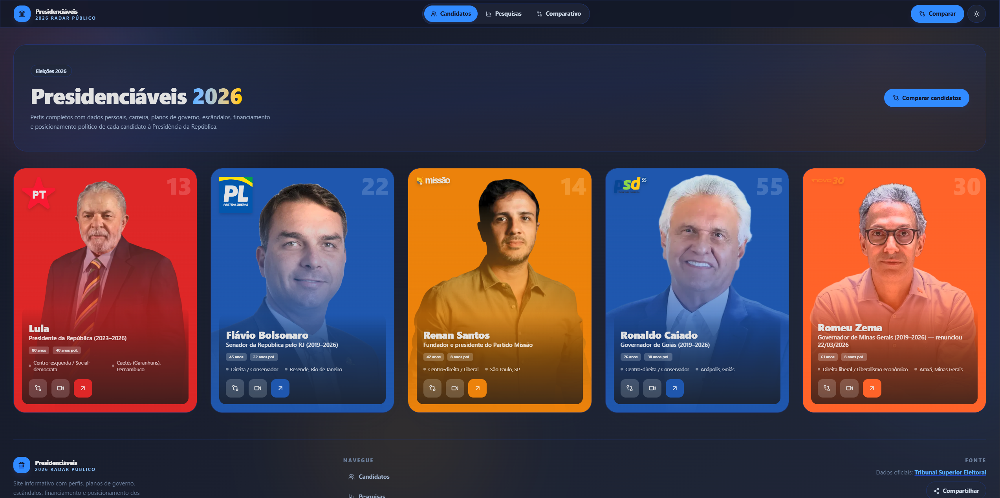

# Presidenciáveis 2026

Comparativo apartidário dos 5 principais candidatos à Presidência do Brasil
em 2026 — Lula (PT), Flávio Bolsonaro (PL), Renan Santos (Missão),
Ronaldo Caiado (PSD) e Romeu Zema (NOVO).



Código-fonte: [github.com/rcarubbi/presidenciaveis-2026](https://github.com/rcarubbi/presidenciaveis-2026)  
Site: [presidenciaveis-2026.vercel.app](https://presidenciaveis-2026.vercel.app)

## Stack

- **Next.js 16** (App Router)
- **React 19**
- **Tailwind CSS 4** (via `@tailwindcss/postcss`)
- **Recharts** (gráficos)
- **TypeScript ~6**
- **Oxlint** (linter)
- **Knip** (dead code analysis)
- **lucide-react** (ícones)
- **sonner** (notificações)
- **Vercel Analytics + Speed Insights**
- **OpenCode** (agente de desenvolvimento)

## Rotas

| Rota | Descrição |
|------|-----------|
| `/` | Visão geral dos 5 candidatos |
| `/candidato/[id]` | Perfil individual (lula, flavio, renan, caiado, zema) |
| `/pesquisas` | Pesquisas eleitorais (institutos + TSE) |
| `/comparar?ids=lula,flavio` | Comparativo lado a lado |

## Scripts

```bash
npm run dev           # desenvolvimento (Turbopack)
npm run build         # build produção
npm run start         # servidor produção
npm run lint          # oxlint
npm run typecheck     # tsc --noEmit
npm run knip          # dead code analysis
npm run fetch:tse     # atualiza CSV de pesquisas do TSE
npm run fetch:youtube # busca vídeos do YouTube via API
npm run fetch:news    # busca notícias recentes via GNews API
```

## Variáveis de ambiente

| Variável | Obrigatória | Descrição |
|----------|-------------|-----------|
| `NEXT_PUBLIC_GA_ID` | Não | Google Tag Manager ID (ex: GTM-...) |
| `NEXT_PUBLIC_BASE_URL` | Não | URL base para sitemap/OG (fallback: presidenciaveis-2026.vercel.app) |
| `YOUTUBE_API_KEY` | Para `fetch:youtube` | API Key do YouTube Data v3 |
| `GNEWS_API_KEY` | Para `fetch:news` | API Key do GNews |

## Dados

~250+ pontos de dados com referência (URL + data) via `DataValue<T>`.
Todas as fontes priorizam imprensa (G1, Folha, UOL, Estadão, CNN, BBC).
Atualização registrada em `src/data/.version.ts`.

### Perfis dos candidatos (`src/data/{candidato}.ts`)
Carreira, posicionamento, escândalos, financiamento e timeline.

### Propostas de governo (`src/data/proposals-{candidato}.ts`)
11 seções temáticas (Segurança, Economia, Saúde, Educação, Previdência,
Infraestrutura, Meio Ambiente, Relações Exteriores, Reforma Política,
Costumes, Agricultura). ~120 propostas no total.

### Cobertura jornalística (SapiensLabs)
Série histórica de sentimento, artigos, top fontes e tópicos vindos da API
[eleicoes2026.sapienslabs.com.br](https://eleicoes2026.sapienslabs.com.br/api/v1),
acessada via proxy em `/api/sapiens/[...path]` com cache de 5 minutos.
O slug de cada candidato na API está mapeado em `src/lib/sapiens/slugs.ts`.

### Pesquisas eleitorais
Duas fontes:
- **Institutos** — Datafolha, Quaest, AtlasIntel, Real Time Big Data
  (dados estáticos em `src/data/polls.ts`)
- **TSE** — CSV oficial de pesquisas registradas, parseado em
  `src/lib/tse/client.ts`

### Mídia (`src/data/media-{candidato}.ts`)
~100+ vídeos do YouTube embedados, organizados por mês/ano
(grupos colapsáveis com contagem). Dados pré-agrupados por mês,
ordenados do mais recente ao mais antigo.

## Automação

O projeto usa [OpenCode](https://opencode.ai) com skills para manutenção:

- `update-content` — atualiza dados de 1 candidato por execução (pesquisas,
  vídeos, propostas, perfil)
- `validate-sources` — valida fontes dos dados (links, consistência numérica)

Skills e configuração do agente em `.opencode/` e `AGENTS.md`.

## Licença

MIT no código. Conteúdos (dados dos candidatos, textos, imagens) seguem
suas respectivas licenças originais.

Site informativo sem fins eleitorais. Art. 57-B Lei 9.504/97.
